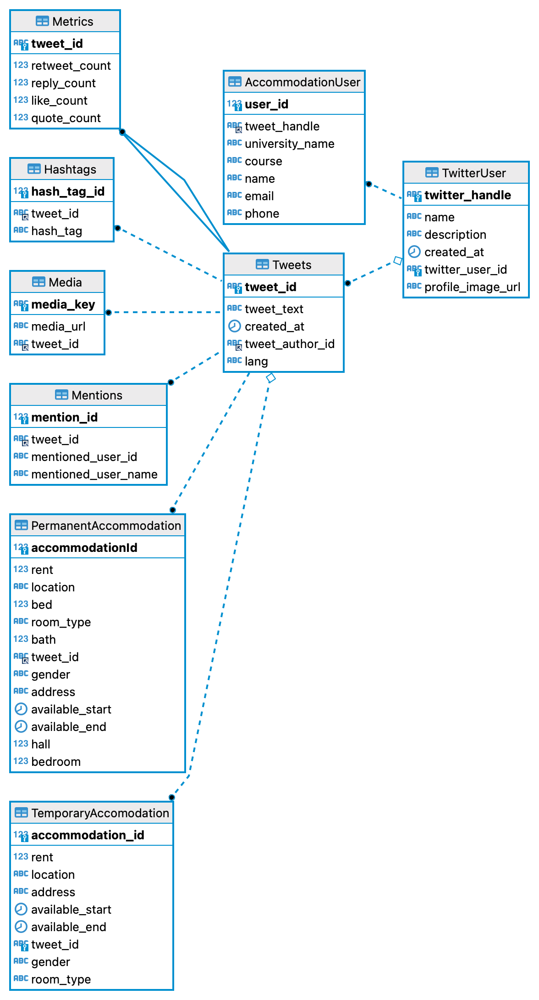
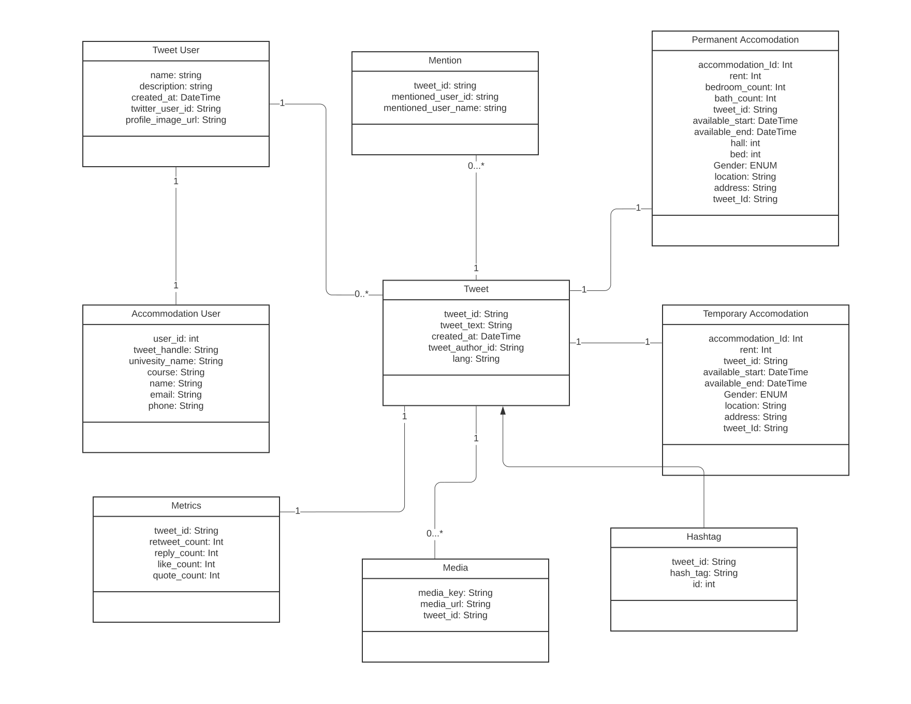
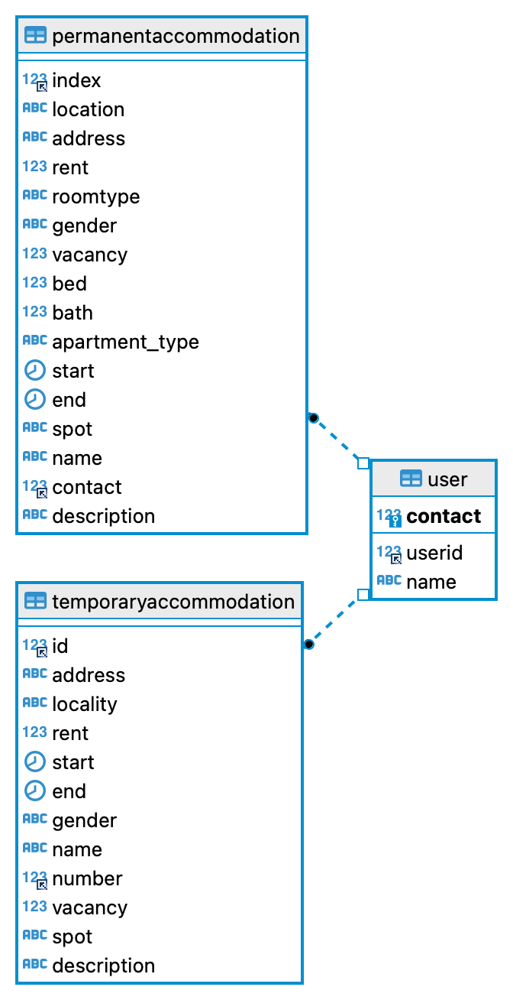
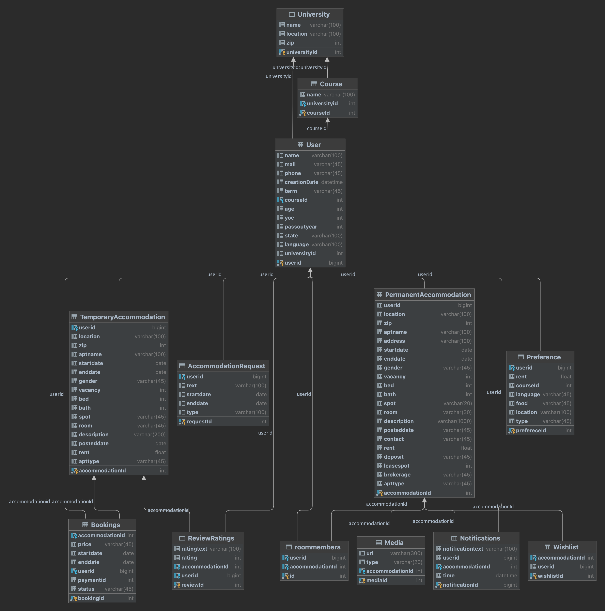

# Accommodation Finder

## Project description

The goal of this project is to build a database that will aid students looking for both temporary and permanent accommodation. Users/Students (hosts) can publish their apartments with the dates it will be available, and students can search for rooms based on their preferences make reservations for temporary accommodation, and contact with the host for permanent accommodation.

### Brief Overview

Hosts will be able to offer their currently rented apartments for permanent housing and short-term housing with their preferences for housemates, apartment images, a video tour, move-in dates, house rules, nearby utilities stores, and method of commuting to school. By using filters based on preferences for room type, hall place, members of the house with matching courses, and university, users will be able to locate permanent or temporary accommodation. Users will be able to view information on members, such as the courses they are enrolled in, their states, their languages, and their contact information, subject to host approval. Users looking for lodging are divided into free and premium subscription plans, which only allow them to access the contact details of the property's host.

### DB Functionalities

1.Host will be able to host their accommodations with move-in dates, rent for the person, number of open spots, photos, an apartment video tour, address, room spot type, apartment info (bed and bath information), laundry access, and preferences for house members (state, food, language, course, university, and no smoking/alcohol). 
2. Users can focus their search for rooms based on attributes including location, dates of stay, and preferences for both temporary and permanent postings. 
3. Based on the user's recorded choices and available dates, accommodations will be displayed. 
4. Users will be able to book and cancel temporary accommodation as well as pay for their stay. 
5. For permanent accommodation, users will have access to the host's contact information, but there will be time and property contact limit restrictions depending on the user subscription plan. 
6. Users can bookmark accommodation listings to view at a later time.
7. Users will be notified of new listings if the property matches their criteria. 
8. Reviews of temporary accommodations can include ratings and remarks 
9. Rent will be categorized based on the spot type, sharing, private rooms with brokerage, deposit if applicable 
10. Members of the house can be either user or if signup as user which will be matched based on email and contact information 
11. Students looking for temporary and permanent can also post their requests

### Entities Overview

1. Each listing will have information related to accommodation type, rent, room type(bed room, shared, private or hall spot), number of guests it can accommodate, vacancies, price, address, photos, amenities and rating and reviews (optional), cancellation policy (temporary accommodation), gender preference, contact information, listing type, house rules

2. Users can be of two types either - host who will post accommodations and user who can view and book accommodations

3. Users will have first name, last name, email id, mobile number, University, course ,valid proof (admit letter, i20), profile picture (optional).

4. Temporary accommodation bookings will have booking_id, checkin and checkout dates, amount paid, cancelable, address and contact information

5. Wishlist to bookmark listings with listing id

6. User preference with pincode, radius, university, course, room type, rent range and other amenities

7. Notifications with accommodation listing info when new accommodations which are matching user preference - notification id, read.

8. Payment table which contains amount payment type, amount paid, transaction time.

9. subscription model - plan type, expiry date, subscription amount

10. Number of properties contacted for permanent accommodation by user

11. room members (non user) which will be added by accommodation host - university, course, state, language.

12. Accommodation request post - userid, postingid, contact, preferences

#### sample tables

https://lucid.app/lucidchart/4e48e608-4331-4bf8-9a1b-17dc185a4e8a/edit?invitationId=inv_3812ce17-7ced-4a98-bd41-0c0def70bd49#

### Project Members

Akshitha Kamshetty
Nageshwara sairam

Github repository link - https://github.com/nagesh161007/accommodation-finder

# Assignment 2

## Temporary/Permanent Accommodation Finder

1.List available temporary accommodations between the dates of Oct 15-2022 to Oct-20-2022 for 2 people

2.List permanent accommodations with private room sorting by lowest rent

3.List permanent accommodations with students pursuing MS in Information systems

4.Get total rent from temporary accommodation bookings within the last week

5.Get temporary accommodations or permanent accommodations near northeastern university

6.List user’s recent contact enquiries for accomodations with the hosts.

7.Display user’s wishlist of temporary and permanent accommodations.

8.Get number of users in the free subscription plan in accommodation finder

9.Display accommodations with preferences from specific country (example - India) and language (Tamil, Hindi)

10.List accommodations with no smoking and no drinking house rules.

11.List temporary accommodations sorting by highest rating and reviews

12.List 2 bed 1 bath permanent accommodations with laundry facility

13.List permanent accommodations with private room vacancy with rent between 650 - 850

14.List accommodations with shops nearby with in 0.3 miles

15.List number of visa approved users from MS Information systems looking for permanent accommodation

16.List the no of female/male/mixed genders rooms available near the entered location.

17.List the accomodationst grouped by a specific amenities .

18.List the room members from a specific state.

19.List all the rooms within the certain university for a specific state.

20.List all the subscription models.

21.List all the check-in dates on the particular dates by permanent/temporary accomadation.

22.List of any specific amenities available in any given range of the location.

23.List of all the room members coming for a specific course

24.List of all the pictures of the people who are renting for the accomidation.

Project Description - https://github.com/nagesh161007/accommodation-finder

### Project Members

Akshitha Kamshetty
Nageshwara sairam

google docs link - https://docs.google.com/document/d/1Oj2fzd9U7lhVq52BtaAzpWVz1b1zCMz5FAPm917ADdE/edit

# Assignment 3

Web Scraping Twitter

## Database physical model

## ER Diagram

### Hospital Admin Sequence Diagram

### UML Diagram

## Project Structure

#### twitter bot

app folder contains twitter bot which scraps twitter and parses and populates the database

`cd app`

`npm install`

Create .env file with

DB_USER_NAME="XXXX"
DB_PASSWORD="XXXXX"
BEARER_TOKEN="Bearer XXXXXXXXXXXXX"

#### queries

All twitter DB queries are inside the queries folder and DB setup is inside the sql folder

#### sql dump

I have added the sql database migration files exported dump inside the database_dump. You can import in mysqlworkbench to run without

### Assignment 3

Assignment 3 - Gathering, Scraping, Munging and Cleaning Data

Tables 

Permanent Accommodation - permanent accommodations posted in whatsapp groups with rent, starting date,  roomtype, gender, location and the user contact and name who posted it.

Temporary Accommodation - temporary accommodations posted in whatsapp groups with rent, starting date, ending data,  roomtype, gender, location and the user contact and name who posted it.

User - user name and user contact which is used as primary key for identifying which user posted the accommodation

Data gathering 

Dataset - Realworld data for Temporary and permanent accommodation csv file gathered from whatsapp groups, google forms and scrapped from websites for permanent accommodations

Datasets gathered as csv files from whatsapp are imported as pandas dataframe to clean and validate

 permanent and temporary accommodations dataframe shape and info are displayed for data types

Rent column in data frame are cleaned by removing dollar symbols and trailing spaces and made as type int for both temporary and permanent accommodations

Missing values for rent are filled with mean value from the data frame 

Missing values for str are replaced with empty strings 

After all data is cleaned all dataframe columns are casted into respective data types

Data visualisation 

Data is visualised with matplotlib libary on four use cases

Temporary accommodation use case

1. Number of temporary accommodation based on locality with histgrams

2. Accommodation availability based on gender using piechart

3. Accommodation availbilty based on spot type using piechart

4. Scatter plot to visualise the rent range distribution accross localities

Importing data to database

Data is inserted to respective tables from their dataframes using sqlalchemy

Updated database Schema

# Assignment 4 

Data base normalization

https://docs.google.com/document/d/1g8-yVlcQFutDTneYTVYy14SL6dA5yaIXRBy0p1E3tAE/edit

Normalized table visualisation 

